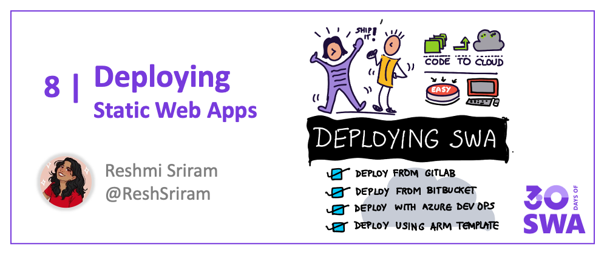

Welcome to `Week 1, Day 7` of **#30DaysOfSWA**!! 

You made it this far! Give yourself a pat on your back already! 😊  

By now, we have learnt what Static Web Apps is, and how to build, add APIs and configure the application. We’ve also deployed a couple of fun apps as a tribute to Star Wars! But we’ve so far explored deploying using the Github Actions path. 
 * What if we want some other CI/CD tool? 
 * What if our project resides safely in an Azure DevOps repository? 
 * What if we don’t want a CI/CD solution AT ALL? 
 
Fear not! Because today we’re gonna explore other ways of deploying a Static Web App on Azure 😊 

## What We'll Cover
 * Deploy With Azure DevOps  
 * Deploy From GitLab and BitBucket 
 * Deploy Using ARM Template 
 * **Exercise**: Explore the [ARM Tools VS Code Extension](https://docs.microsoft.com/en-us/azure/azure-resource-manager/templates/quickstart-create-templates-use-visual-studio-code?tabs=CLI)

 
## Deploy with Azure DevOps 

Deploying using Azure pipelines CI/CD has never been easier! 

Static Web Apps supports projects which are stored in Azure repos and helps in creating a smooth CI/CD pipeline to automatically trigger the changes on every commit to the main branch. What more? With the latest changes checked in for Azure DevOps, we can now set up the azure pipeline via Portal with a single click! Here’s a quick video demonstrating how to use DevOps as a pipeline, as well as touching on the numerous other enhancements brought in off-late, such as stable staging environments, password protected websites, build and deploy split, and lots more! 😊 

<iframe  width="560" height="315" frameborder="0" src="https://www.youtube.com/embed/4JkfeZp7aDk" title="YouTube video player" frameborder="0" allow="accelerometer; autoplay; clipboard-write; encrypted-media; gyroscope; picture-in-picture" allowfullscreen></iframe>

 
## Deploy via GitLab and BitBucket 

But what if we wanted a third-party Provider? Static Web Apps as of today officially supports CI/CD pipelines from GitLab and BitBucket! We just have to follow a few simple steps as discussed in the documentation for both GitLab and BitBucket, and voila! We’ll have a beautifully configured pipeline which takes care of the automatic trigger on commits for us. Isn’t this beautiful? 😊 

 
## Deploy using ARM Template 

For the CLI lovers out there, we can also deploy in Static Web Apps using ARM Templates! The ARM, or the Azure Resource Manager Template, is used in preparing the workflow template. On deploying the ARM Template to Azure Static Web Apps, it triggers the Github Actions, which further takes care of our CI/CD needs. Do check out the exercise later in the blog for a quick hands-on using ARM Templates!  

But what about .. **deploying without a CI/CD??** 

Suppose we want a one-time deployment solution? Or we don’t want to depend on a CI/CD tool at all! No worries! We have you covered! Wonder how that is supported? Stay tuned to the #30DaysOfSWA series and **discover the new upcoming features** to enable this! 😉 <3<3  

## Resources

Now that we’ve explored the alternatives we have, let’s go have some fun with it!! Here are a few quickstarts you can try out!

1. [Deploy using BitBucket](https://aka.ms/swabitbucketsupport) 
2. [Deploy using GitLab](https://aka.ms/swagitlabsupport) 
3. [Deploy using Azure DevOps and Portal Quickstart](https://aka.ms/static-web-apps-publish-devops)  
4. [Use an ARM template quickstart](https://docs.microsoft.com/en-us/azure/static-web-apps/publish-azure-resource-manager?tabs=azure-cli) 

 

 