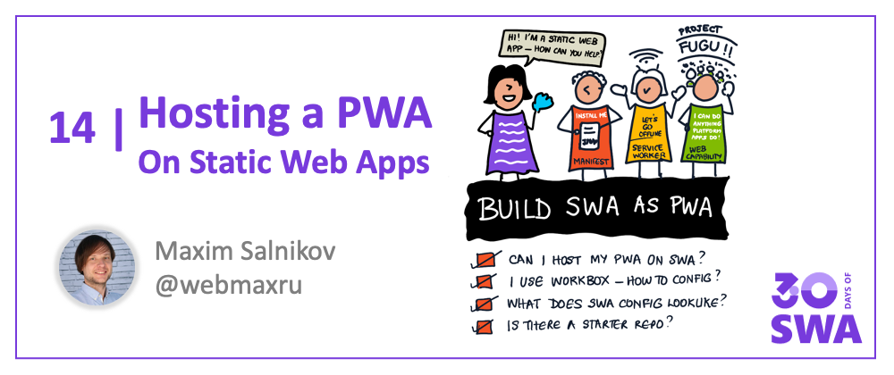

Welcome to `Week 2, Day 6` of **#30DaysOfSWA**!! 

Yesterday we talked about deploying Blazor apps on Static Web Apps. Let's continue today with one more type of the projects you can successfully host on SWA - Progressive Web Apps (PWAs).

npm install workbox-build

npm install rollup, rollup-plugin-node-resolve, rollup-plugin-replace, rollup-plugin-terser

## What We'll Cover
 * How do I start with building a PWA?
 * Optimized PWA-on-SWA configuration
 * Advanced techniques for better user experience
 * **Exercise:** [Deploy your PWA on SWA, run offline, and install it](https://github.com/webmaxru/pwa-on-swa)

## Progressive Web Applications

A Progressive Web App (PWA) is a web frontend application that is progressively enhanced using open web technologies, to make sure it delivers the best possible experience on every device, based on available capabilities. The "baseline" for your app to have a title "progressive" is its installability and offline-readiness. We skip "served with https" requirement because it became a baseline for any web app these days.

This chapter of #30DaysOfSWA assumes that you are familiar with the basic concepts of a Service Worker API and automating your service worker with the Workbox library. If you wish to learn about these technologies, you are welcome to go through Core Concepts part of the [#30DaysOfPWA](https://aka.ms/30DaysOfPWA) project to learn about PWA fundamentals, and to watch [Automating a service worker with Workbox 6](https://www.youtube.com/watch?v=LILGt_pHk9M&ab_channel=NDCConferences) video for quickstart with Workbox.

## Is hosting a PWA on Azure Static Web Apps different from "classic" apps?

Progressive Web Application is still a web frontend app so the initial scaffolding of your SWA resource is the same - you have learned how to deploy and configure various types of the web apps from the previous chapters of the #30DaysOfSWA. But to make sure that your "PWA on SWA" works as intended both online & offline to provide the best possible user & developer experiences, you might need to pay special attention to some implementation details, and to fine-tune some configuration options. We'll go trough the following points in this chapter:

- Building your service worker as a part of the overall app build
- Setting up HTML5 routing - for the Single-Page Application (SPA) usecase
- Applying caching strategies for SWA-hosted APIs
- Showing custom error pages
- How to deal with authentication in PWA

**Sample project**

I created a [PWA on SWA Starter](https://github.com/webmaxru/pwa-on-swa) project with all the best practices implemented. Technical stack:

- A React application scaffolded by [create-react-app](https://reactjs.org/docs/create-a-new-react-app.html) tool. A simple SPA with a few routes and possibility to call API endpoints. Please note: the techniques described in this chapter are applicable for any web frontend application: framework-based (including your custom frameworks) or "vanilla" JavaScript. We use React only for getting closer to the real-world scenarios of the modern frontend apps development, when you have to perform some operations with your source code ("build the app") before the deployment.
- A [service worker](https://github.com/webmaxru/pwa-on-swa/blob/main/src/sw/service-worker.js) powered by the [Workbox](https://workboxjs.org) library.
- Two API endpoints created within SWA resource - to emulate "dynamic" (`/api/news`) and "conservative" (`/api/archives`) data.

## Building your service worker as a part of the overall app build

## Setting up HTML5 routing - for the Single-Page Application (SPA) usecase

## Applying caching strategies for SWA-hosted APIs

## Showing custom error pages

## How to deal with authentication in PWA

## Exercise: Deploy your PWA on SWA, run offline, and install it!

Hopefully you're ready to try something fun that will reinforce what you learned today. 

For this exercise:

* [Fork the PWA on SWA Starter repository](https://github.com/webmaxru/pwa-on-swa) and deploy it to Azure Static Web Apps using the skills you gained in the previous chapters of the #30DaysOfSWA
* Open the url you received after SWA resource was created
* Now, go offline (disconnect from the Internet or emulate offline mode in the DevTools) and reload the page - it still works!
* Using the "App available" icon on the right hand side of the desktop browser's address bar, install the application on your laptop - now it behaves like a native one!

---

## Resources

Here are some resources to get you started with your Progressive Web App journey into 

 * [PWA on Microsoft Docs](https://aka.ms/learn-pwa)
 * [#30DaysOfPWA](https://aka.ms/30DaysOfPWA)
 * [Workbox library](https://workboxjs.org)
