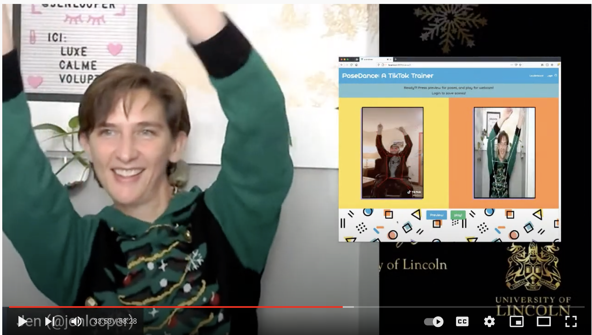
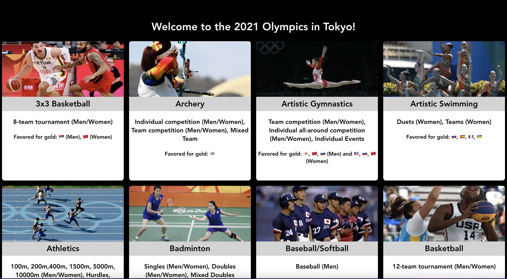

Welcome to `Week 2, Day 7` of **#30DaysOfSWA**!! 

Vuelievers, rejoice! Today we'll explore several examples of how you can build a Static Web App with Vue.js. In this article, I'll give several examples of sites I've created using Vue and VuePress, a popular way to build static sites with Vue. I'll also walk through a game engine we created in VuePress that you can deploy as a SWA, and touch on the use of Vite.js, a lightning-fast toolkit you can use to build all types of applications, built by the masterminds behind the Vue.js projects.

## What We'll Cover
 * PoseDance and Ombromanie
 * The Azure Mysteries
 * An Olympic App built with Vite.js
 * **Exercise**: Try your hand at using VuePress to build your own game and deploy it as a SWA.
 * **Resource(s):** VuePress, Vite.js, Vue.js

In this article, I'll describe the following projects, which are more fully explained on their README files in their respective repositories. The first apps I'd like to showcase are PoseDance and Ombromanie. Both were developed as conference talks and have become interesting case studies in how to use TensorFlow.js in web apps, specifically focusing on body poses and hand poses for innovative user experiences.

PoseDance is your friendly TikTok trainer: watch a TikTok dance video, learn the dance, then enter a side-by-side view of the original dance with a 'skeleton' imposed on it to the left, with your own video on the right. Try to make your body poses match that of the dancer, and win a high score!

PoseDance offers a full view of SWA capabilities, including an API buildout so that the user can login and save their high scores. To save scores, it also uses [PlayFab](https://playfab.com/) in the backend. In addition this repo has a Code Tour! Code Tours are a neat little Visual Studio Code extension that, if installed locally, will allow you to walk through the codebase in a guided manner, to learn the rationale behind code architecture. Install that extension in VS Code and give it a try! You can watch a [video](https://www.dropbox.com/s/ccog8uz0tzk10mv/posedance.mp4?dl=0) about the making of PoseDance. Slides are available [here](https://github.com/jlooper/posedance/blob/master/posedance.pptx). Find the codebase [here](https://github.com/jlooper/posedance)

Dance with us: https://wonderful-ocean-007be220f.1.azurestaticapps.net/

---

Ombromanie is a demo I built for a different conference talk that was described as "un peu OVNI" ("a little UFO-like") - in this demo, mimic the hand shadows that you used to make using just a candle and a dark room, to freak out and entertain your siblings. This app, also built using Vue.js like PoseDance, also leverages TensorFlow.js and bodyposing, this time focusing on hand poses, which are actually more complex than body poses, as there are more bendable joints in play. 

Use the Ombromanie app to record a video of your special hand shadow story, coupled with voice-to-text transcription of your story, and then share it. 

A full blogpost can be found [here](https://dev.to/azure/ombromanie-creating-hand-shadow-stories-with-azure-speech-and-tensorflow-js-handposes-3cln)

Slides are available [here](https://github.com/jlooper/ombromanie/blob/main/ombromanie.pptx)

Watch the conference talk describing this app [here](https://www.youtube.com/watch?v=8Aow0rkp1Lw&ab_channel=MTGFrance).

Try this app! https://brave-river-00627910f.1.azurestaticapps.net/

---

For Microsoft Build conference 2021, I built an app to demonstrate how to use Vite.js to build a simple 'card flipping' app. Since it was close to the Summer Olympics, I featured all the Olympic sports in this interesting interface. Building with Vite is similar to building with Vue, although the location of the files is different. But deployment as a SWA is just as straightforward.

In this video, you can build the app along with me, and watch me deploy it as a SWA. Watch it here: https://www.youtube.com/watch?v=Xpl-KukvEmM&ab_channel=MicrosoftDeveloper

Build it yourself: https://github.com/jlooper/olympic-app - you can start on the student branch and build up the app following the video instructions, or just look at the entire complete codebase.
 
Take a look at the Olympic App: https://kind-mushroom-0f7f4200f.1.azurestaticapps.net/

---

Finally, and something really different, I'd like you to meet SpaceQuest, a game engine that I developed with inspiration and help from my colleague Chris Noring. SpaceQuest is a game engine that you can use to build your own games, and deploy as a SWA, in the tradition of text-based point and click adventure games. We used this engine as the core to build the Azure Maya Mystery and the Azure Space Mystery, all deployed as SWAs to great acclaim. Read about these SWA Mysteries here:

Azure Maya Mystery: 
    The Making of: https://dev.to/azure/azure-maya-mystery-the-inner-workings-of-a-static-web-app-hkp
    Introduction: https://dev.to/azure/unraveling-the-azure-maya-mystery-and-building-a-world-4pp2
    The Mysterious Cenote: https://dev.to/azure/azure-maya-mystery-part-ii-the-mysterious-cenote-3j57
    Ascent to the Summit: https://dev.to/azure/azure-maya-mystery-part-iii-ascent-to-the-summit-41hi
Azure Space Mystery: 
    Introduction: https://dev.to/azure/blast-off-with-azure-advocates-presenting-the-azure-space-mystery-mdd

SpaceQuest had a very special purpose, other than being the seed code of the mysteries, however. We used it in a series of workshops with Autistic students to teach them how to build their own games, in partnership with the National Museum of Computing at Bletchley Park. Read more about this work [here](https://dev.to/azure/making-games-with-autistic-students-a-partnership-between-the-national-museum-of-computing-track-org-and-azure-advocates-3c1e). It was a tremendous honor to work with these talented students!

Try the app here: https://zealous-mushroom-04674420f.1.azurestaticapps.net/

And build a mystery of your own by forking the codebase and building up your storyline https://github.com/jlooper/static-game-engine

