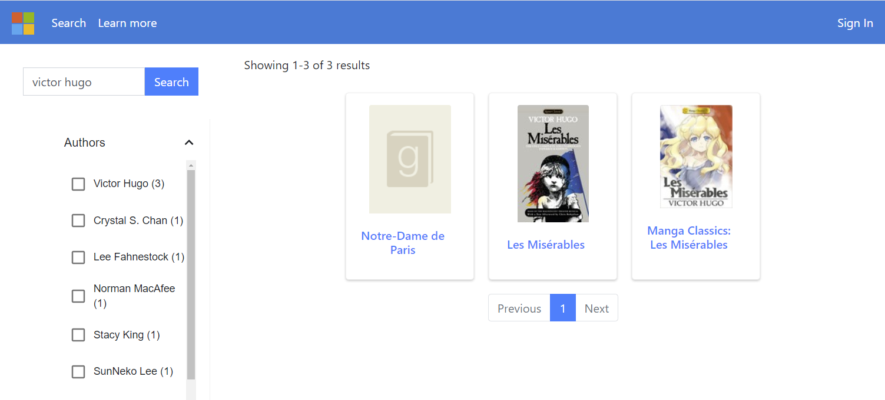
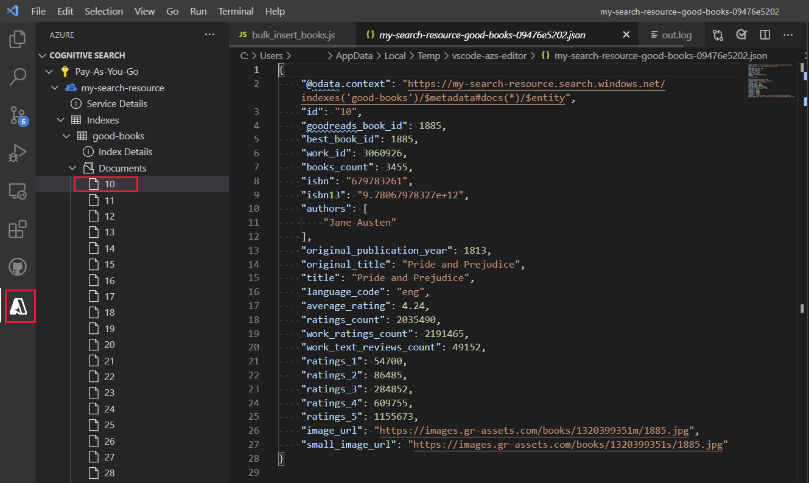

Welcome to `Week 4, Day 2` of **#30DaysOfSWA**!! 

Yesterday we talked about end-to-end developer experience. Today we'll explore adding search to a website.


## What We'll Cover
 * What is Azure Cognitive Search?
 * What is a search index?
 * Add search to website
 * Deploy to SWA
 * **Exercise**: Upload data to search index
 * **Exercise**: Deploy sample to SWA 
 * **Resource(s):** 


Today we explore adding search to a website with Azure Cognitive Search. Azure Cognitive Search provides many capabilities for searching and even provides extensibility with provided or custom functionality.

The [complete source code](https://github.com/Azure-Samples/azure-search-javascript-samples/blob/master/search-website/) is provided for you.



This example of Cognitive Search shows the most common use of search for a website and demonstrates how fast it is to get up and running. This sample website provides access to a catalog of 10,000 books. A user can search the catalog by entering text in the search bar. While the user enters text, the website uses the Search Index's suggest feature to complete the text. Once the query finishes, the list of books is displayed with a portion of the details. A user can select a book to see all the details, stored in the Search Index, of the book.

## What is Azure Cognitive Search?

Azure Cognitive Search is a cloud search service that gives you, as the developer, the ability to provide rich search experiences. Architecturally, a search service sits between the external data stores that contain your unindexed data, and your client app that sends query requests to a search index and handles the response.


Cognitive Search can integrate with other Azure services that automate data ingestion/retrieval from Azure data sources, and skillsets that incorporate consumable AI from Cognitive Services, such as image and natural language processing, or custom AI that you create in Azure Machine Learning or wrap inside Azure Functions.

Once you create your Azure resource for Cognitive Search, you can access the service with the following vital information:

* Resource name: what you named your Cognitive Search instance.
* Index name: your resource can hold several indexes, each identified with a name.
* Admin key: used to upload data into the search index
* Query key: used by the API to find data in the search index

## What is a search index?

Search functionality needs data to query. In Azure Cognitive Search, this data is held in a _search index_. Because this sample is already written for you, that includes the upload of the JSON data into the search index. 

The trickiest part of this process is mapping your data into Cognitive Search types. In order to do this, you provide a [schema file](https://github.com/Azure-Samples/azure-search-javascript-samples/blob/master/search-website/bulk-insert/good-books-index.json) that describes each data field. 


### Searchable title

An example of a field in the schema file for this book catalog is the book title:

```json
{
    "name": "title",
    "type": "Edm.String",
    "facetable": false,
    "filterable": false,
    "key": false,
    "retrievable": true,
    "searchable": true,
    "sortable": false,
    "analyzer": "standard.lucene",
    "indexAnalyzer": null,
    "searchAnalyzer": null,
    "synonymMaps": [],
    "fields": []
},
``` 

The **type** is a `Edm.String` and it uses the `standard.lucene` **analyzer**. It is searchable and retrievable (comes back in the query results).

### Filter by language

The book catalog search also allows a filter by language. This filter, known as a facet, is provided by the **facetable** property.

```json
{
    "name": "language_code",
    "type": "Edm.String",
    "facetable": true,
    "filterable": true,
    "key": false,
    "retrievable": true,
    "searchable": false,
    "sortable": false,
    "analyzer": null,
    "indexAnalyzer": null,
    "searchAnalyzer": null,
    "synonymMaps": [],
    "fields": []
},
```

### Suggest search terms as a user types

The schema also tells the search index what fields to watch when providing search **suggesters**, as the user types an entry in the search box. For this sample, suggestions are based on author names and book titles.

```json
"suggesters": [
{
    "name": "sg",
    "searchMode": "analyzingInfixMatching",
    "sourceFields": [
    "authors",
    "original_title"
    ]
}
```

Once the search index is created with data, you can view the data in the Visual Studio Code extension for Cognitive Search.



## Add search to website

After the search index is created with the data, you can add search functionality through the UI. Your UI passes the user's search request to your API. The API queries the search index and returns the results. 

The [client code](https://github.com/Azure-Samples/azure-search-javascript-samples/blob/master/search-website/src) provides interactive functionality:
* Provides [Search component](https://github.com/Azure-Samples/azure-search-javascript-samples/blob/master/search-website/src/components/SearchBar/SearchBar.js)
    * Provides [suggestions](https://github.com/Azure-Samples/azure-search-javascript-samples/blob/master/search-website/src/components/SearchBar/Suggestions/Suggestions.js) from the API as the user types in the search box
    * [Filters the results](https://github.com/Azure-Samples/azure-search-javascript-samples/blob/master/search-website/src/components/Facets/Facets.js) when the user selects or deselects from a list of filters (facets).
* Provides [results component](https://github.com/Azure-Samples/azure-search-javascript-samples/blob/master/search-website/src/components/Results/Results.js), possibly [paging](https://github.com/Azure-Samples/azure-search-javascript-samples/blob/master/search-website/src/components/Pager/Pager.js). 

The [serverless code](https://github.com/Azure-Samples/azure-search-javascript-samples/tree/master/search-website/api) provides the following API to respond to client requests:
* [Search](https://github.com/Azure-Samples/azure-search-javascript-samples/blob/master/search-website/api/Search/index.js) the catalog
* Provide [suggestions](https://github.com/Azure-Samples/azure-search-javascript-samples/blob/master/search-website/api/Suggest/index.js)
* Get [specific item's](https://github.com/Azure-Samples/azure-search-javascript-samples/tree/master/search-website/api/Lookup) data

## Deploy to SWA

The sample is deployed to SWA from a GitHub action, created for you by the Visual Studio Code extension for SWA.

Once you create and deploy the sample, you need to set environment variables to connect from the serverless API to your Cognitive Search resource. Then the book catalog website is available and searchable. 

## Exercise: Upload data to search index

1. [Fork the GitHub sample repo](https://docs.microsoft.com/azure/search/tutorial-javascript-overview#fork-and-clone-the-search-sample-with-git), and clone it to your local computer. This is a necessary step because the GitHub action needs to be written to a repo your user account has access to.
1. [Create a resource group](https://docs.microsoft.com/azure/search/tutorial-javascript-overview#create-a-resource-group-for-your-azure-resources) to hold both your SWA and Cognitive Search resources.
1. [Create a search index](https://docs.microsoft.com/azure/search/tutorial-javascript-create-load-index#create-an-azure-search-resource) in Visual Studio Code with the Cognitive Search extension.  
1. [Get the admin key](https://docs.microsoft.com/azure/search/tutorial-javascript-create-load-index#create-an-azure-search-resource). 
1. [Set admin key and resource name](https://docs.microsoft.com/azure/search/tutorial-javascript-create-load-index#prepare-the-bulk-import-script-for-search) in sample's bulk_insert_books.js script. 
1. Don't check in these changes with git. You don't want these secrets in your public fork.
1. [Install dependencies and bulk insert data](https://docs.microsoft.com/azure/search/tutorial-javascript-create-load-index#run-the-bulk-import-script-for-search) in the `./bulk-insert` folder:

    ```javascript
    npm install && npm start
    ```

1. Your search index is ready to answer search queries.

## Exercise: Deploy SWA to Azure

1. In Visual Studio Code, [create the SWA resource](https://docs.microsoft.com/azure/search/tutorial-javascript-deploy-static-web-app#create-a-static-web-app-in-visual-studio-code). This process adds a GitHub action YAML file to your fork and deploys that version to your SWA resource.

    At this point, the website should be available, but search isn't connected yet.

1. [Get the query key](https://docs.microsoft.com/azure/search/tutorial-javascript-deploy-static-web-app#get-cognitive-search-query-key-in-visual-studio-code) for your search index. Your API needs these secrets (query key and Cognitive Search resource name), to answer queries from your serverless API.
1. [Set the secrets](https://docs.microsoft.com/azure/search/tutorial-javascript-deploy-static-web-app#add-configuration-settings-in-azure-portal) for your serverless API in the Azure portal. 

    Search is now connected from your API to your Cognitive Search index.

1. [Use your search-enabled website](https://docs.microsoft.com/azure/search/tutorial-javascript-deploy-static-web-app#use-search-in-your-static-web-app) to find a book. 
1. Type _slowly_ to see the suggestions based on what you enter.
1. Filter the results to a different language. 
1. Select a book to see all its details. 

## Troubleshooting

* Make sure you used the **admin key** in the upload file.
* Make sure you used the **query key** in the SWA config. 


## Next steps

This website provides basic search functionality for books. Go beyond the basics with:
* [Spell check](https://docs.microsoft.com/en-us/azure/search/speller-how-to-add)
* [Fuzzy search](https://docs.microsoft.com/en-us/azure/search/search-query-fuzzy)
* [Semantics](https://docs.microsoft.com/en-us/azure/search/semantic-ranking)

