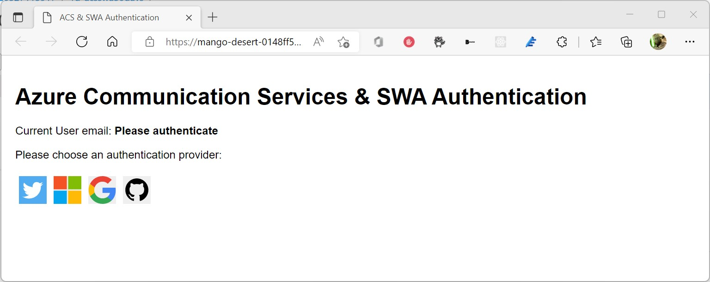
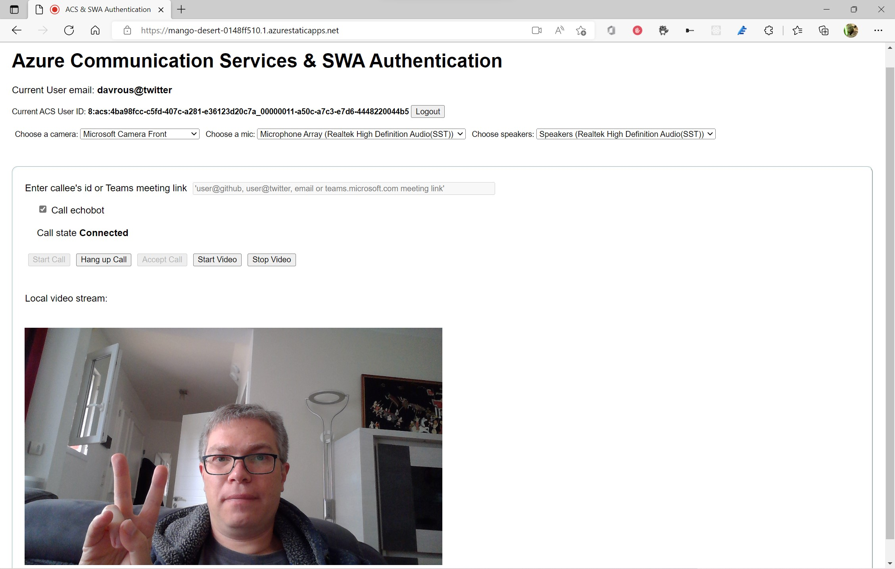
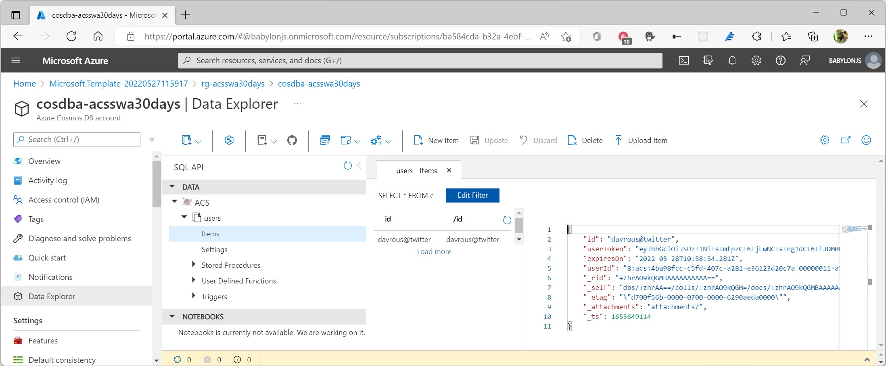
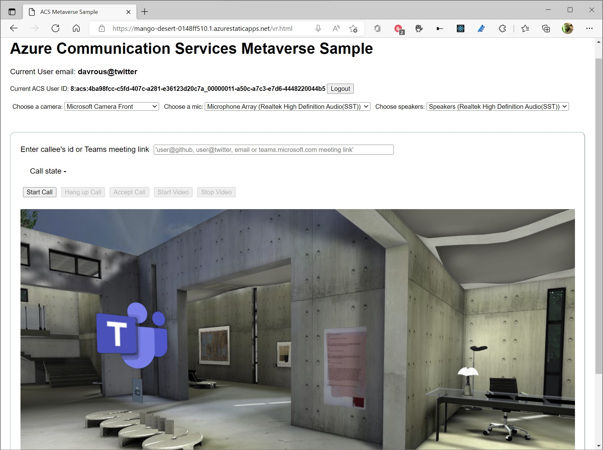

Welcome to `Week 4, Day 6` of **#30DaysOfSWA**!! 

Yesterday we talked about .... Today we'll explore ...

## What We'll Cover
 * What is Azure Communications Services aka ACS?
 * Building an authentication layer with Azure Function, CosmosDB & Static Web App
 * A Static Web App hosting a Metaverse?!?
 * **Exercise** deploy the sample yourself following the step-by-step tutorial

## What is Azure Communications Services aka ACS?

[Azure Communication Services (ACS)](https://docs.microsoft.com/en-us/azure/communication-services/overview) is a set of rich communication, video, and SMS APIs to deploy your applications across any device, on any platform. If you want to enable emails, chat, audio/video conferencing, phone calls or SMS inside an existing app, this service is right for you. You can view it as your building blocks to create your own custom version of Microsoft Teams, it uses the same underlying infrastructure. This [CPaaS](https://www.forbes.com/advisor/business/software/what-is-cpaas/) (Communications Platform As A Service) will manage scalability, quality & availability of this service for you. This platform is also built on top of our secure and compliant cloud.  

Watch this short video for a quick introduction 👇🏼

<iframe width="560" height="315" src="https://www.youtube.com/embed/chMHVHLFcao" title="YouTube video player" frameborder="0"  allowfullscreen></iframe> 

Of course, this service comes with a price. You can find the cost of each service by visiting [Azure Communication Services pricing | Microsoft Azure](https://azure.microsoft.com/en-us/pricing/details/communication-services/). 

ACS exposes its services via various SDKs: [Azure Communication Services – Samples and Tools](https://github.com/Azure/communication) available for JavaScript, .NET, Java, Android, iOS & Python developers. 

You can also optionally use this on top of the ACS UI library: [Overview – Page ⋅ Storybook](https://azure.github.io/communication-ui-library/?path=/story/overview--page) which consists of React-based components implementing the [Microsoft Fluent Design](https://developer.microsoft.com/fluentui/) to help you build visually engaging web apps. The best sample mixing all of these concepts is [Group calling hero sample – An Azure Communication Services sample overview](https://docs.microsoft.com/en-us/azure/communication-services/samples/calling-hero-sample?pivots=platform-web). 

To give you a brief idea, have a look to this 2 min video tutorial. It will show you how to get the internal ACS authentication token to connect to its infrastructure. Then, I’ll join an existing Teams meeting using a simple web page and the ACS JavaScript SDK:

<iframe width="560" height="315" src="https://www.youtube.com/embed/FFBBLUtRyZw" title="YouTube video player" frameborder="0"  allowfullscreen></iframe> 

If you’d like to follow it at home, you simply need to:
-	[Create an Azure Communication Services resource in your Azure Portal](https://docs.microsoft.com/en-us/azure/communication-services/quickstarts/create-communication-resource?tabs=windows&pivots=platform-azp) 
-	Navigate to https://aka.ms/acsquicktest and follow the video tutorial above.

You’ll discover that, by default, Azure Communication Services is providing a basic authentication & identity layer. You need to build on top of it to connect your own identity platform. Let’s see how to do that!

## Building an authentication layer with Azure Function, CosmosDB & Static Web App
Well, it turns out that SWA provides an awesome out of the box authentication experience. To know more about it, please read: [Authentication and authorization for Azure Static Web Apps](https://docs.microsoft.com/en-us/azure/static-web-apps/authentication-authorization?tabs=invitations). In seconds, without any additional code required, you’ll have an authentication layer provided to you!

We’re going to use it as our front end to welcome and authenticate our users. Then, we will map their social account identity with the internal ACS identity via an Azure Function. The Azure Function will store the mapping into a small CosmosDB table. 

Here’s the flow. First, you’ll land on a page asking you to choose your favorite social provider:

Then, once authenticated, you’ll be directly connected to the Azure Communication Services infrastructure. No need to generate a token or whatever, the Azure Function took care of it. I’ve been using my Twitter account in this screenshot for instance:

You see that the UI shows how my Twitter account, *davrous@twitter*, is mapped to the internal ACS user ID *8:acs:4ba98fcc*… that you should normally not share to the users of course 😉. 

Thanks to that, you’re ready to call friends and colleagues immediately or join a Teams meeting via simply using their social account email address as the person to call.

Let’s have a look to the Azure Function code enabling this scenario. First, you can see in the [function.json file](https://github.com/davrous/acsauth/blob/main/api/users/function.json) that I’m using the CosmosDB binding feature. To know more about this feature:
-	[Azure Cosmos DB input binding for Functions 2.x and higher](https://docs.microsoft.com/en-us/azure/azure-functions/functions-bindings-cosmosdb-v2-input?tabs=in-process%2Cfunctionsv2&pivots=programming-language-javascript)
-	[Azure Cosmos DB output binding for Functions 2.x and higher](https://docs.microsoft.com/en-us/azure/azure-functions/functions-bindings-cosmosdb-v2-output?tabs=in-process%2Cfunctionsv2&pivots=programming-language-csharp)

In a nutshell, via a simple declaration in the *function.json* file, you have a simple data access layer available in your Azure Function code for free. 

If you look into my json file, I’m defining a route under *users/{email}/{lookup:bool?}* that will be exposed under 2 functions in my Azure Function: *setUser* as the output binding (to write or update into CosmosDB) and *getUser* as the input binding (to read from CosmosDB). 

In this declaration file, I’m also asking the Azure Function to use the CosmosDB database named “*ACS*” with the table named “*users*” using “*email*” parameter as the partition key. 

*getUser* will be called with a first required parameter which is an email address associated to the ACS internal identity. It has a second optional parameter which is a boolean. This asks to the Azure Function to do a simple resolve query to return the internal ACS id associated with the email address. It’s useful when you’d like to call someone on ACS by simply providing his email address rather than being forced to know its internal ACS identity (starting with *8:acs:xxx*).

*setUser* simply create a new record or update it.

You can find the complete source code of the Azure Function there: [acsauth/index.ts at main · davrous/acsauth (github.com)](https://github.com/davrous/acsauth/blob/main/api/users/index.ts). 

The first block is simply doing the resolve logic I was mentioning just before. The second block is first checking if the user has already been created in the CosmosDB table and if the ACS token is still valid. Indeed, ACS tokens are valid for 24 hours only. If the user doesn’t exist or if its token has expired, we’re using the ACS JavaScript SDK to create a new identity & authentication token to map it to the email address. 

If you’re interested in the ACS identity concepts, please read:
-	[Identity model - An Azure Communication Services concept](https://docs.microsoft.com/en-us/azure/communication-services/concepts/identity-model)
-	[Quickstart - Create and manage access tokens - An Azure Communication Services quickstart](https://docs.microsoft.com/en-us/azure/communication-services/quickstarts/access-tokens?pivots=programming-language-javascript)

Now, let’s have a look to what’s stored in the CosmosDB table thanks to the Azure Portal:

You can find all the required information for my scenario:
-	**id**: an email address coming from the social network, which is my partition key and my primary key for my requests
-	**userId**: the associated internal ACS identity in the form of 8:acs:xxxx.
-	**userToken**: the associated internal ACS authentication token required to be able to connect to the ACS infrastructure
-	**expiresOn**: when the ACS authentication token will expire

The beauty of the Azure Function binding feature is that I didn’t have to write any code to manage the reading or writing part of the records. It can even update an existing record if needed. 

With few lines of code, I’ve been able to create a small authentication layer on top of ACS to create users mapped to ACS internal identity. With the out of the box Static Web App authentication experience, I didn’t even need to write any code to authenticate users with their social identity!

## A Static Web App hosting a Metaverse?!?

In the same sample, I’ve been building on top of the architecture described just above a small metaverse using [Babylon.js](https://www.babylonjs.com), an open source & free WebGL engine I’ve been contributing to. The logic is identical to what I’ve described up to now. Thanks to the SWA, I’m authenticating the user using his social profile. But then, I can do the video call to another ACS user or someone in Teams from a 3D scene. And everything is waayyy cooler inside a 3D scene, right? 

But wait, there’s even better. You can experience this Babylon.js scene in VR thanks to its native WebXR support! To give you an idea, here’s a video where I’m using my Valve Index to call my girl friend in Teams so we can visit this museum together.

<iframe width="560" height="315" src="https://www.youtube.com/embed/Wd4qNeLV_P8" title="YouTube video player" frameborder="0"  allowfullscreen></iframe> 

If you’re interested in WebXR, I’ve written a full article on what you can build with it sharing lot of my samples: [From gaming to metaverses, building WebXR apps with Babylon.js – David Rousset (davrous.com)](https://www.davrous.com/2022/04/12/from-gaming-to-metaverses-building-webxr-apps-with-babylon-js/).

## Exercise

If you’d like to play and learn from this sample mixing ACS, SWA, Azure Function, CosmosDB & Babylon.js, you can **deploy it in less than 10 minutes** by following the step-be-step tutorial available in this associated repo: [davrous/acsauth: Deploy in less than 10 min an Azure Communication Services sample to be shared & tested with your colleagues & friends](https://github.com/davrous/acsauth).

Enjoy and see you in the metaverse! 😊
